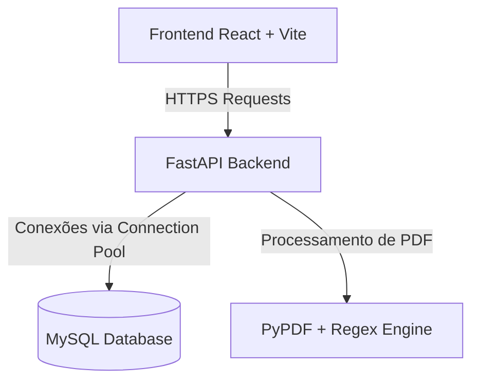
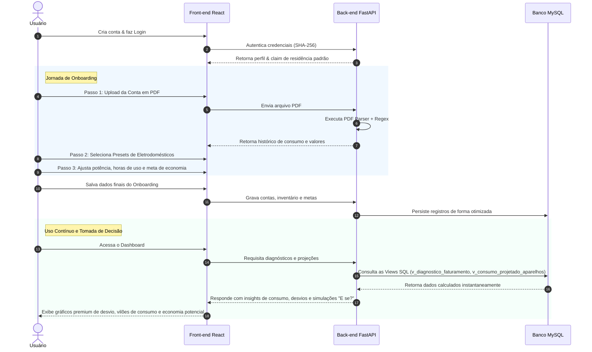

# 🌿 EcoConta — Plataforma Inteligente de Gestão de Consumo Elétrico

O **EcoConta** é uma solução completa, inovadora e sustentável focada no monitoramento inteligente de energia elétrica residencial. Unindo inteligência analítica de dados e gamificação, a plataforma permite aos usuários compreenderem exatamente onde seu dinheiro está sendo gasto na conta de luz, mapearem o desvio de consumo em relação aos seus eletrodomésticos, realizarem simulações ecológicas e definirem metas audaciosas de economia financeira e ambiental (redução da pegada de carbono).

---

## 🚀 1. O que a Plataforma Faz

O EcoConta resolve a opacidade da conta de luz tradicional transformando dados brutos em inteligência residencial prática:

*   **Leitura Automática de Faturas (OCR/PDF Parsing)**: O usuário faz o upload do PDF oficial da sua distribuidora de energia (ex: Cemig, Enel) e a plataforma extrai automaticamente a data de faturamento, o histórico de consumo dos últimos 13 meses, o consumo ativo (kWh), os dias do ciclo e o valor total faturado.
*   **Diagnóstico Inteligente de Consumo**: Cruza os dados da fatura real com o inventário doméstico do usuário para indicar exatamente qual a precisão do mapeamento (Ex: *"Você mapeou 85% do seu consumo real"*) e qual o desvio em kWh.
*   **Simulador Ecológico "E se?"**: Um motor que projeta cenários instantâneos de economia física (kWh), financeira (R$) e ecológica (redução de kg de CO₂) sob três faixas de redução de uso dos aparelhos (10%, 20% e 30%).
*   **Gestão de Inventário Doméstico**: Cadastro ágil de eletrodomésticos com base em um catálogo global de presets eficientes de mercado ou personalização completa pelo usuário (potência em Watts, horas diárias de uso e dias por mês).
*   **Gamificação por Metas**: Definição de objetivos percentuais de redução (ex: meta de 15% de economia) que estimulam hábitos de consumo mais conscientes através de feedbacks visuais.

---

## 🛠️ 2. Stacks Tecnológicas & Arquitetura

A plataforma foi desenhada sob uma arquitetura desacoplada de alto desempenho, robustez de dados e excelente experiência de usuário.



### **Backend (API)**
*   **FastAPI (Python 3.14)**: Framework de alta performance para a construção de APIs assíncronas rápidas e robustas, documentadas automaticamente via OpenAPI (Swagger).
*   **MySQL Connection Pooling**: Utilização de `mysql-connector-python` com gerenciador de pool de conexões ativo para isolamento de transações, segurança e máxima velocidade de acesso.
*   **PyPDF & Regex Parser**: Motor customizado para leitura automática de faturas focado em layouts de energia complexos.
*   **Segurança (SHA-256)**: Armazenamento seguro de senhas através de algoritmos de hash criptográfico unidirecional.

### **Frontend**
*   **React + Vite**: Setup moderno de frontend focado em carregamento instantâneo, componentização limpa e reatividade ágil.
*   **Vanilla CSS Moderno**: Estilização premium baseada em HSL dinâmico, variáveis CSS organizadas, animações fluidas, efeitos de *glassmorphism* e design totalmente responsivo com suporte a modo escuro/claro nativo e paleta de cores sofisticada.

---

## 📊 3. Estratégias de Dados & Modelagem SQL

Uma das maiores forças do EcoConta está na sua inteligência de dados modelada diretamente na camada de persistência. A estratégia utiliza **Stored Generated Columns**, **Índices Otimizados** e **Views Analíticas** de negócio:

### **Tabelas do Banco de Dados**
1.  `usuarios`: Cadastro seguro de usuários com restrições e hashes criptográficos.
2.  `residencias`: Entidade que representa os lares, permitindo suporte a múltiplas residências por conta (com remoção em cascata).
3.  `contas_energia`: Histórico de faturamento. Contém uma **Coluna Gerada (Stored)** `tarifa_calculada` que divide dinamicamente o valor da fatura pelo consumo, gerando a tarifa real com impostos e bandeiras inclusas de forma estática.
4.  `presets_eletrodomesticos`: Catálogo global de eletrodomésticos padrão para cadastro rápido.
5.  `inventario_usuario`: Inventário personalizado do lar do usuário com suas respectivas potências e tempos de uso.
6.  `metas_economia`: Histórico de metas de economia ativas e inativas do lar.

### **Views Analíticas de Performance**
Para manter a API extremamente rápida e o código limpo, os cálculos de lógica de negócios são processados via Views SQL otimizadas no MySQL:
*   `v_consumo_projetado_aparelhos`: Calcula o consumo projetado em kWh, custo financeiro correspondente (com base na tarifa mais recente da residência) e a pegada de carbono estimada em kg de CO₂ para cada aparelho.
*   `v_diagnostico_faturamento`: Cruza o faturamento real mensal com a soma de todo o inventário mapeado para expor os desvios físicos e percentuais.
*   `v_simulador_modo_e_se`: Motor analítico que gera projeções instantâneas de mitigação de carbono e economia financeira em três cenários de redução simultaneamente (10%, 20% e 30%).

---

## 🗺️ 4. Jornada do Usuário (User Journey)

A experiência do usuário foi projetada para ser simples, educacional e recompensadora:



### **1. Onboarding Orientado**
*   **Entrada Facilitada**: O usuário cria sua conta de forma rápida e segura.
*   **Fase 1 (Importação)**: O sistema solicita uma fatura de energia em PDF. O motor lê a conta e preenche instantaneamente o consumo do mês e o histórico.
*   **Fase 2 (Inventário Ágil)**: O usuário monta o inventário de sua casa clicando em presets pré-configurados (Ex: Ar Condicionado Split, Chuveiro, Geladeira) ao invés de digitar números complexos.
*   **Fase 3 (Refinamento & Meta)**: O usuário ajusta as horas de uso reais e escolhe seu desafio de economia (ex: meta de 15% de redução).

### **2. Engajamento Diário & Análise**
*   **Visão Geral (Dashboard)**: Exposição em tempo real da fatura mais recente, barra de progresso da meta e o percentual mapeado da residência.
*   **Vilões de Consumo**: Gráfico interativo e ordenado mostrando quais eletrodomésticos gastam mais dinheiro e geram mais CO₂.
*   **Ação no Modo "E se?"**: O usuário clica e vê instantaneamente o impacto de reduzir o uso do chuveiro em 10% ou desligar o ar-condicionado 20% mais cedo, permitindo uma tomada de decisão consciente.
*   **Gestão de Faturas**: Tela de histórico para acompanhamento e importação de faturas de novos meses.

---

## ⚙️ 5. Como Executar a Plataforma

### **Pré-requisitos**
*   **Python 3.10+** (Recomendado Python 3.14+)
*   **Node.js 18+**
*   **MySQL Server 8.0+**

### **Passo 1: Banco de Dados**
Importe e execute o script `ecoconta_schema_mysql.sql` no seu servidor MySQL (através do MySQL Workbench, terminal, ou DBeaver) para criar o banco de dados, tabelas, índices, views analíticas e presets iniciais.

### **Passo 2: Configuração e Execução do Backend**
1. Acesse a pasta do projeto.
2. Crie um ambiente virtual (opcional) e instale as dependências:
   ```bash
   pip install fastapi uvicorn mysql-connector-python pydantic pypdf
   ```
3. Configure as variáveis de ambiente necessárias (ou use os fallbacks nativos para localhost):
   *   `MYSQL_HOST` (Padrão: `localhost`)
   *   `MYSQL_USER` (Padrão: `root`)
   *   `MYSQL_PASSWORD` (Padrão: `1!Acesso#9`)
   *   `MYSQL_DATABASE` (Padrão: `ecoconta`)
4. Execute o servidor de desenvolvimento:
   ```bash
   uvicorn main:app --reload --port 8000
   ```

### **Passo 3: Configuração e Execução do Frontend**
1. Acesse a pasta `frontend`.
2. Instale as dependências do projeto:
   ```bash
   npm install
   ```
3. Inicie o servidor de desenvolvimento:
   ```bash
   npm run dev
   ```
4. Abra o navegador no link gerado (geralmente `http://localhost:5173`) para experimentar a plataforma completa EcoConta!
